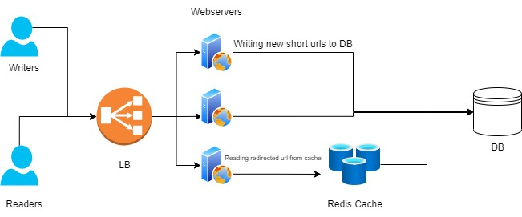

# bitly

## What is URL Shortening System ?
In laymen's terms URL Shortening is a service we can shorten the original link.
You provide a long URL and system outputs a short URL which can be used as an alternative to long url.

## Requirement 
1. Input Original Link and a unique and short url will be outputted
2. High Availability of the system (Zero Downtime, 100% Availability, Deploy it on K8s service ?)
3. Minimum Latency (We can use caching during redirect, deploy the infra on cloud with geo-replication)

## Analysis
### Things to consider
1. Number of request for reading the URL
2. Number of request for writing (shortening) the URL
3. Storage require for DB (Capacity)
4. Storage require for caching (Redis)
5. Web servers hosting (Ideal scenario would be to host on k8s which provides features of Auto Scaling, Auto Restart etc.) 
6. Shortening Algorithm Used
7. Security - Hackers can spam the system with random urls
8. Database type used for storage

## High Level Design

1. Two kinds of users
   1. Reader - User who will hit the short url and will be redirected to original long url
   2. Write - User who comes to bitly portal to shorten the URL
2. Web Servers - Backend servers that will transform/shorten the URL and also redirect user to original URl
3. Redis Cache - Caching layer that will used in order ro cache the redirect url for more frequently used URls.
4. Database
5. Load Balancer - LB to distribute request among the web servers